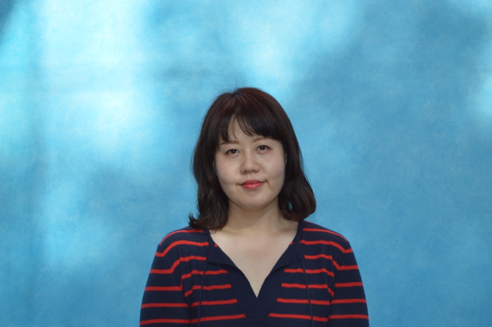

{width=60% height=70%}

Welcome!
I am currently a Ph.D. candidate in the Department of Political Science at the University of Pittsburgh, specializing in Comparative Political Economy and International Relations.  My research seeks to understand how wealth inequality affects political behavior. I mainly use the cases of Korea and the US but also study other democracies as a lens through which to address core questions about wealth inequality and representation. 

My dissertation examines how increased inequality, especially house prices inequality, affects political polarization looking at different political actors such as parties, legislators, and voters. I use text analysis methods relying on campaign brochures from Korean elections and roll-call data of the Korean legislature to study the relationship between voters' preferences at the district-level and politicians' policy positioning.

Prior to coming to Pittsburgh, I worked as a foreign service officer in the Korean Ministry of Foreign Affairs and the head of HR and Administration at the Permanent Delegation of the Republic of Korea to the OECD in France. I also worked as a public-private partnership consultant at the UN-APCICT in Korea and as a research intern on climate change & foreign aid at the Asia Foundation in Malaysia.

I can be contacted at euk27@pitt.edu

You can download my [CV](https://drive.google.com/file/d/1AyNaGW4o_irQkLp7vs0fMRYOBw11GLIa/view?usp=sharing) here.

